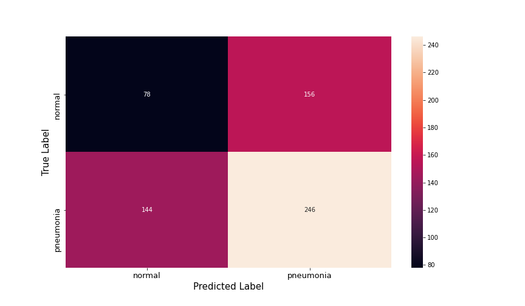

# PneumoniaClassification

## Pneumonia

* [Pneumonia_MayoClinic](https://www.mayoclinic.org/diseases-conditions/pneumonia/symptoms-causes/syc-20354204#:~:text=Pneumonia%20is%20an%20infection%20that,and%20fungi%2C%20can%20cause%20pneumonia.)

According to the MayoClinic (link above), "Pneumonia is an infection that inflames the air sacs in one or both lungs." People with Pneumonia experience caughing, extreme phlegm, fever, difficulty breathing, and chills. Pneumonia, like many other illness, is very uncomfortable. That's why neural networks models are used to classify an image of a lung without Pneumonia compared to the image of a Pneumonia patients lung. This way the doctor can learn more about the disease to correctly classify patients as having Pneumonia or not having Pneumonia. 

### Data

* [Kaggle Datasets](https://www.kaggle.com/paultimothymooney/chest-xray-pneumonia)

[RadiologyInfo](https://www.radiologyinfo.org/en/info.cfm?pg=pneumonia) says a radiologist will look for white spots in the lungs to identify an infection.

### Methods

This generic model has 78 true normal images, 246 true pneumonia images, 144 false negatives (patient has pneumonia and the model didn't catch it), and 156 false positives (patient does not have pneumonia but the model says they are ill). This model is very weak. There are a ton of false negatives and false positives.

Model 2 has 177 true normal images, 350 true pneumonia images, 40 false negatives (patient has pneumonia and the model didn't catch it), and 57 false positives (patient does not have pneumonia but the model says they are ill).

Model 3 has 190 true normal images, 354 true pneumonia images, 36 false negatives (patient has pneumonia and the model didn't catch it), and 44 false positives (patient does not have pneumonia but the model says they are ill).

Model 4 has 113 true normal images, 384 true pneumonia images, 6 false negatives (patient has pneumonia and the model didn't catch it), and 121 false positives (patient does not have pneumonia but the model says they are ill). This is the strongest model, but far from perfect.

Model 5 has 199 true normal images. It also has 323 true pneumonia images, 67 false negatives, and 35 false positives (patient does not have pneumonia but the model says they are ill).

## Conclusion and Recommendation

In conclusion, model 4 was the most optimal model of the five. The Adam optimizer was the best optimizer for the models. Model four had fewest false negatives. It was a very close call with model three. The equation for recall is true positive over true positives and false negatives. High recall means there aren't many false negative. A false negative would be bad. Upon receiving a false negative for pneumonia one would go without treatment. A false positive could be bad because one might get treated for an illness they don't have. In this case I believe a false negative would be worse because a patient wouldn't get the care they need. 

I recommend using a computer with appropriate hardware in order to run the most efficient model. My recommendations would be to add in many epochs and use a small learning rate The faster the model takes to foward and backward propogate, the faster one can collect the recall, precsion, and accuracy of every model. Thus, more time would be available to create models. To create the most accurate model largest sample size possible (more pneumonia images and images of lungs without pneumonia) would be needed.

